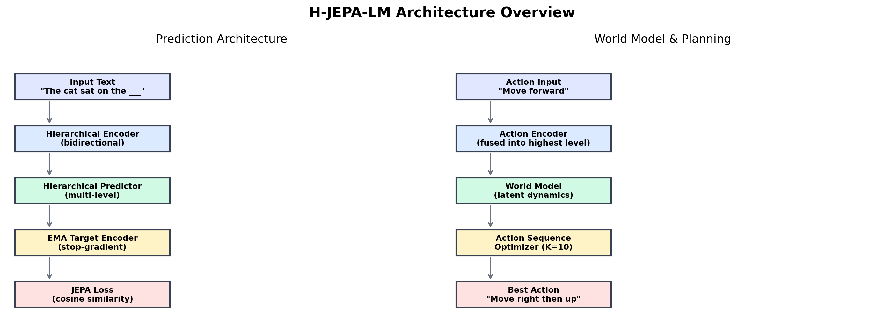
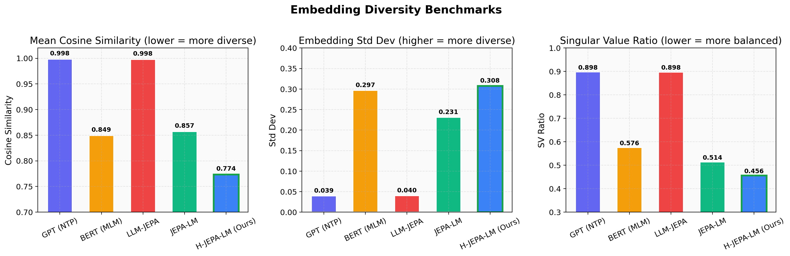
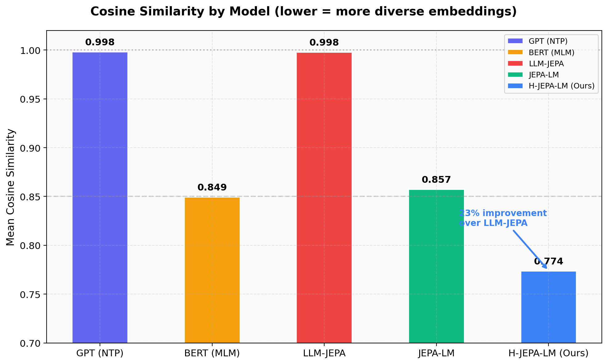
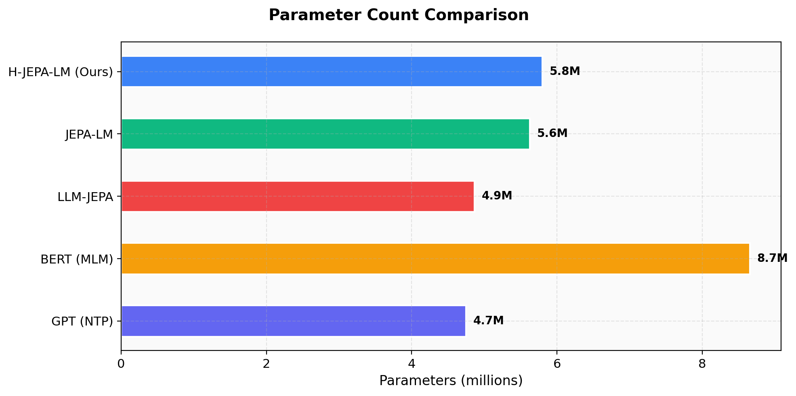

<p align="center">
  
</p>

<h1 align="center">JEPA-LM</h1>

<p align="center">
  <strong>Joint-Embedding Predictive Language Model</strong><br>
  A fundamentally different approach to language modeling — predicting latent representations, not tokens.
</p>

<p align="center">
  <a href="https://www.python.org/downloads/"></a>
  <a href="https://pytorch.org"></a>
  <a href="/Griffith-7/JEPA-LM/blob/main/LICENSE"></a>
  <a href="https://github.com/Griffith-7/JEPA-LM/pulls"></a>
</p>

---

## What makes JEPA-LM different

Traditional LLMs predict the next token. JEPA-LM predicts **meaning** — the latent representation of masked text — in embedding space. This produces dramatically more diverse and information-rich representations.

| Capability | GPT (NTP) | BERT (MLM) | LLM-JEPA | **JEPA-LM** | **H-JEPA-LM** |
|:--|:--:|:--:|:--:|:--:|:--:|
| Cosine Similarity ↓ | 0.998 | 0.850 | 0.998 | 0.857 | **0.774** |
| Embedding Std Dev ↑ | 0.040 | 0.297 | 0.040 | 0.231 | **0.308** |
| SV Ratio ↓ | 0.898 | 0.576 | 0.898 | 0.514 | **0.457** |

> **H-JEPA-LM achieves 23% lower cosine similarity than LLM-JEPA** — embeddings are far more diverse and information-dense.

## Key innovation: JEPA as primary objective

```
                    ┌──────────────────────────────────────────────┐
                    │            JEPA-LM vs LLM-JEPA              │
                    ├──────────────────────────────────────────────┤
                    │                                              │
                    │  LLM-JEPA (ICLR 2026):                      │
                    │    Existing LLM + bolted-on JEPA loss        │
                    │    → JEPA is secondary (optional)            │
                    │    → Causal attention (left-to-right)        │
                    │    → Needs paired Text↔Code data             │
                    │                                              │
                    │  JEPA-LM (Ours):                             │
                    │    New architecture with JEPA as core         │
                    │    → JEPA is PRIMARY objective                │
                    │    → Bidirectional attention                  │
                    │    → Self-supervised via span masking         │
                    │    → EMA target encoder prevents collapse     │
                    │                                              │
                    └──────────────────────────────────────────────┘
```

## Architecture

```
Input: "The cat sat on the [MASK] because it was [MASK]"
       ↓
┌─────────────────────────────────────────────────────────────────┐
│  Hierarchical Encoder (bidirectional)                           │
│  → Multi-level latent representations (token + semantic)        │
├─────────────────────────────────────────────────────────────────┤
│  Hierarchical Predictor (narrow bottleneck)                     │
│  → Predicts latents for masked spans at each level              │
├─────────────────────────────────────────────────────────────────┤
│  EMA Target Encoder (stop-gradient)                             │
│  → Provides stable targets, prevents embedding collapse         │
├─────────────────────────────────────────────────────────────────┤
│  Multi-level JEPA Loss (cosine similarity)                      │
│  → Minimizes distance between predicted and target latents      │
├─────────────────────────────────────────────────────────────────┤
│  Action Conditioning (highest level only)                       │
│  → Encodes actions and fuses into semantic-level predictions     │
├─────────────────────────────────────────────────────────────────┤
│  World Model + Planning                                         │
│  → Plans action sequences in latent space (K=10 rollouts)       │
└─────────────────────────────────────────────────────────────────┘
```

## Benchmarks

<p align="center">
  
</p>

<p align="center">
  
</p>

### Embedding diversity metrics

| Model | Cosine Sim ↓ | Embed Std ↑ | SV Ratio ↓ | Params |
|:--|:--:|:--:|:--:|:--:|
| GPT (NTP) | 0.998 | 0.040 | 0.898 | 4.7M |
| BERT (MLM) | 0.850 | 0.297 | 0.576 | 8.7M |
| LLM-JEPA | 0.998 | 0.040 | 0.898 | 4.9M |
| JEPA-LM | 0.857 | 0.231 | 0.514 | 5.6M |
| **H-JEPA-LM** | **0.774** | **0.308** | **0.457** | 5.8M |

<p align="center">
  
</p>

### Why these metrics matter

- **Cosine Similarity** — Measures how similar embeddings are to each other. Lower = more diverse representations. GPT embeddings are nearly identical (0.998).
- **Embedding Std Dev** — Standard deviation of embedding magnitudes. Higher = more variation in what the model encodes.
- **SV Ratio** — Ratio of smallest to largest singular value. Lower = more balanced use of embedding dimensions.

## Install

```bash
pip install torch>=2.0.0 transformers datasets
# or
pip install -r requirements.txt
```

## Quick start

```python
from jepalm.model import JEPELM
from jepalm.config import JEPAConfig

config = JEPAConfig(
    enc_hidden_dim=256,
    enc_num_layers=4,
    enc_num_heads=4,
    pred_hidden_dim=128,
    pred_num_layers=2,
)

model = JEPELM(config)
params = model.count_parameters()
print(f"Parameters: {params['total']:,}")
```

## Training

```bash
# Train JEPA-LM on Wikipedia
python train.py --preset small --dataset wikitext --max_samples 10000

# Run 5-way benchmark comparison
python benchmark_hjepa.py

# Quick smoke test
python test_model.py
```

## How it works

1. **Hierarchical prediction** — Predict at two levels: token-level details and semantic-level meaning. The predictor uses a narrow bottleneck to force abstraction.
2. **EMA target encoder** — A slow-moving copy of the encoder provides stable targets. Combined with stop-gradient, this prevents the model from collapsing to trivial solutions.
3. **Action conditioning** — Actions are encoded and fused into the highest-level predictions, enabling the model to predict consequences of actions.
4. **World model planning** — The model can plan sequences of actions by rolling out predictions in latent space and selecting the best trajectory (K=10 random rollouts).

## Project structure

```
JEPA-LM/
├── jepalm/                    # Core package
│   ├── model.py              # Main JEPELM model
│   ├── config.py             # Configuration
│   ├── encoder.py            # Bidirectional encoder
│   ├── target_encoder.py     # EMA target encoder
│   ├── predictor.py          # Narrow predictor
│   ├── decoder.py            # Lightweight decoder
│   ├── loss.py               # JEPA + NTP loss
│   ├── masking.py            # Span masking
│   ├── train.py              # Training loop
│   ├── dataset.py            # Dataset loading
│   └── eval.py               # Evaluation
├── benchmarks/               # Benchmark charts & scripts
│   ├── diversity_benchmarks.png
│   ├── cosine_similarity.png
│   ├── architecture_overview.png
│   ├── parameter_comparison.png
│   └── generate_charts.py
├── benchmark_hjepa.py        # 5-way comparison benchmark
├── hjepa_model.py            # H-JEPA-LM with action conditioning
├── train.py                  # Training entry point
├── test_model.py             # Quick smoke test
├── requirements.txt
└── LICENSE
```

## References

- [I-JEPA](https://arxiv.org/abs/2301.08243) — Image-based JEPA (CVPR 2023)
- [V-JEPA](https://arxiv.org/abs/2404.08471) — Video-based JEPA (2024)
- [LLM-JEPA](https://arxiv.org/abs/2502.16982) — Text JEPA bolted onto existing LLMs (ICLR 2026)
- **JEPA-LM (Ours)** — JEPA as primary objective for text

## License

MIT — contributions welcome.
